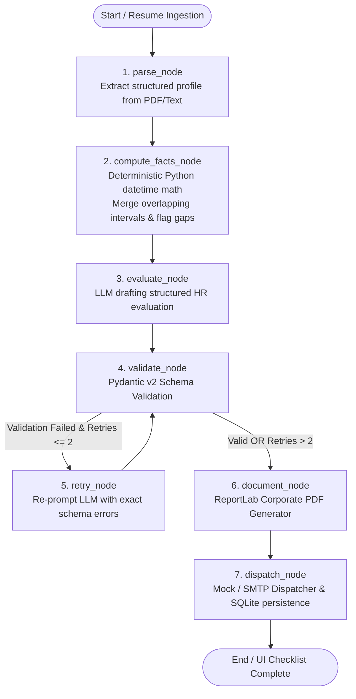

# AI Recruiter Copilot — Evidence-Driven Candidate Evaluation Agent

[](https://fastapi.tiangolo.com)
[](https://langchain-ai.github.io/langgraph/)
[](https://react.dev)
[](https://vitejs.dev)
[](https://tailwindcss.com)
[](https://docs.pydantic.dev)
[](https://www.reportlab.com)
[](https://opensource.org/licenses/MIT)

> **An evidence-driven, autonomous AI recruiter copilot that extracts candidate facts, enforces deterministic date arithmetic, refrains from inferring unexplained gaps, answers recruiter queries with line-level evidence citations, and autonomously orchestrates an HR evaluation pipeline via LangGraph to generate executive corporate PDF artifacts and dispatch them via SMTP.**

---

## Table of Contents
1. [Executive Summary & Problem Statement](#1-executive-summary--problem-statement)
2. [Key Differentiators & Anti-Hallucination Guarantees](#2-key-differentiators--anti-hallucination-guarantees)
3. [System Architecture & LangGraph State Machine](#3-system-architecture--langgraph-state-machine)
4. [Feature Breakdown](#4-feature-breakdown)
5. [Tech Stack](#5-tech-stack)
6. [Repository & Directory Structure](#6-repository--directory-structure)
7. [API Specification & Endpoints](#7-api-specification--endpoints)
8. [Environment Configuration](#8-environment-configuration)
9. [Local Setup & Quick Start Guide](#9-local-setup--quick-start-guide)
10. [Benchmark Testing Walkthrough (Aarav Sharma)](#10-benchmark-testing-walkthrough-aarav-sharma)
11. [Automated Test Suite](#11-automated-test-suite)
12. [Docker & Production Deployment](#12-docker--production-deployment)
13. [Evaluation Rubric Compliance Matrix](#13-evaluation-rubric-compliance-matrix)

---

## 1. Executive Summary & Problem Statement

### The Problem
Recruiters repeatedly read complex resumes to answer basic screening questions (*"Does this candidate know AWS?"*, *"How many years of relevant experience do they have?"*, *"Why is there an employment gap in 2023–2025?"*). They then manually re-type these facts into HR evaluation forms. This manual workflow is:
- **Slow & Tedious:** 20–30 minutes lost per candidate.
- **Inconsistent:** Different screeners assess experience and skills differently.
- **Prone to Hallucinations & Bias:** Evaluators and naive LLM wrappers frequently invent plausible explanations for missing data or double-count concurrent roles.

### The Solution: AI Recruiter Copilot
An autonomous, evidence-grounded recruiter agent that:
- **Extracts structured facts** from PDF and JSON resumes into canonical Pydantic models.
- **Executes deterministic date arithmetic** to merge overlapping employment intervals and detect employment gaps (> 60 days) mathematically without LLM inference.
- **Answers recruiter questions with explicit line citations**, returning `"Not specified in the resume."` when facts are absent.
- **Orchestrates an autonomous LangGraph pipeline** with a bounded self-correcting validation retry loop, generating executive corporate PDF artifacts and dispatching them via SMTP.

---

## 2. Key Differentiators & Anti-Hallucination Guarantees

| Feature | Naive LLM Implementations | AI Recruiter Copilot (This Project) |
|---|---|---|
| **Years of Experience** | Asked directly to LLM; hallucinated or incorrectly added | **Deterministic Math**: Pure Python `datetime` merging overlapping intervals |
| **Employment Gaps** | Hallucinates reasons (*"Likely took sabbatical or freelance"*) | **Strictly Flagged Unexplained**: Flagged as `unexplained` unless explicitly documented |
| **Missing Facts** | Guesses or assumes competencies based on job titles | **Explicit Fallback**: Responds `"Not specified in the resume."` with `grounded: false` |
| **Evidence Audit Trail** | Unverified narrative outputs | **Field-Level Citations**: Every claim cites verbatim quotes and source sections |
| **Schema Integrity** | Unvalidated JSON causing downstream rendering crashes | **Pydantic v2 + LangGraph Self-Correction**: Bounded retry loop (max 2) with error feedback |
| **Progress Visibility** | Black-box loading spinners | **Real-Time Server-Sent Events (SSE)**: Live multi-step execution checklist |

---

## 3. System Architecture & LangGraph State Machine

The agent workflow is governed by a stateful **LangGraph** pipeline (`StateGraph`) with a conditional routing loop:



### LangGraph Nodes in Detail
1. **`parse_node`**: Extracts raw text using `PyMuPDF` (`fitz`) and maps candidate data into `CandidateProfile`.
2. **`compute_facts_node`**: **Anti-hallucination cornerstone.** Computes exact total experience in years and identifies gaps > 60 days. Persists record in SQLite.
3. **`evaluate_node`**: Drafts candidate evaluation, recommended role, and evidence citations using the configured LLM provider.
4. **`validate_node`**: Validates generated JSON against the canonical `Evaluation` Pydantic model. Enforces that deterministic ground truth (`years_of_experience`, `employment_gaps`) is untouched.
5. **`retry_node`**: Self-correction node. Feeds exact Pydantic validation error traces back to the LLM to fix issues.
6. **`document_node`**: Renders executive-grade PDF reports with ReportLab.
7. **`dispatch_node`**: Dispatches notification to HR inbox via SMTP (or structured mock logger) and updates SQLite run logs.

---

## 4. Feature Breakdown

### 1. Ingestion & Deterministic Date Engine
- **Multi-Format Input:** Accepts PDF resumes or JSON mock payloads.
- **Interval Merging Algorithm:** Correctly handles overlapping roles (e.g., full-time job + concurrent advisory role) so experience is never double-counted.
- **Gap Detection:** Detects intervals exceeding 60 days between roles and flags them as `status: "unexplained"` with `reason: null` unless explicit reasons exist in the text.

### 2. Evidence-Grounded Q&A (`/api/chat`)
- Natural-language recruiter interface for arbitrary candidate questions.
- Prompts constrain responses to the candidate profile and raw resume text only.
- Strict anti-hallucination filter:
  - Absent skills or companies (e.g., *"Did they work at Microsoft?"*) → `"Not specified in the resume."` (`grounded: false`).
  - Unexplained gap inquiries (e.g., *"Why did they take a break in 2023?"*) → Explicitly states the dates of the gap and refuses to invent reasons.

### 3. Agentic Evaluation with Real-Time SSE (`/api/evaluate`)
- Recruiter clicks **"Generate HR Evaluation"** to trigger the LangGraph pipeline.
- Progress streams live over **Server-Sent Events (SSE)** to the recruiter UI:
  - `✓ Parsed resume into structured profile`
  - `✓ Deterministic math: verified experience & employment gaps`
  - `✓ Generated structured HR evaluation draft`
  - `✓ Validated schema against Pydantic model`
  - `✓ Generated executive corporate PDF artifact`
  - `✓ Dispatched evaluation report to HR inbox`

### 4. Executive Corporate PDF Report
- Built with **ReportLab** (`backend/app/documents/pdf_builder.py`).
- Includes candidate summary, contact information, key skillset badges, education history, chronological experience table, high-contrast employment gap alerts, and field-by-field evidence citations.
- Available for instant download via `/api/evaluation/{id}/download`.

### 5. Dual-Mode HR Dispatcher
- **Mock Mode (`MOCK_SMTP=true`):** Writes clean structured log payloads to disk/console with recipient, subject, and PDF attachment path (ideal for local testing and CI/CD).
- **Live SMTP (`MOCK_SMTP=false`):** Sends emails with PDF attachments using standard SMTP (Gmail, SendGrid, Amazon SES, etc.).

---

## 5. Tech Stack

| Layer | Technologies |
|---|---|
| **Backend Framework** | [FastAPI](https://fastapi.tiangolo.com) (Python 3.11+), Uvicorn, ASGI |
| **Agent Orchestration** | [LangGraph](https://langchain-ai.github.io/langgraph/), LangChain Core |
| **Data Validation** | [Pydantic v2](https://docs.pydantic.dev) |
| **Database & ORM** | SQLite, SQLAlchemy 2.0 (Models: `CandidateDB`, `EvaluationDB`, `AgentRunDB`) |
| **PDF Extraction** | PyMuPDF (`fitz`), pdfplumber |
| **PDF Generation** | ReportLab |
| **LLM Providers** | Groq (`llama-3.1-8b-instant`), Google Gemini (`gemini-2.0-flash-lite`, `gemini-2.5-flash`), OpenAI (`gpt-4o-mini`), LiteLLM, Deterministic Offline Fallback |
| **Frontend Framework** | React 18, Vite 5, React Router v6 |
| **Styling & Icons** | TailwindCSS 3.4, Lucide React |
| **Testing** | Pytest, FastAPI TestClient, Requests |
| **Containerization** | Docker, Render Blueprint (`render.yaml`) |

---

## 6. Repository & Directory Structure

```
Saarthi Task/
├── backend/
│   ├── app/
│   │   ├── main.py                # FastAPI entry point, CORS, static mounts, lifespan
│   │   ├── schemas.py             # Pydantic v2 canonical schemas (CandidateProfile, Evaluation, etc.)
│   │   ├── db/
│   │   │   ├── session.py         # SQLite engine and session factory
│   │   │   └── models.py          # SQLAlchemy models (CandidateDB, EvaluationDB, AgentRunDB)
│   │   ├── routes/
│   │   │   ├── resume.py          # /api/resume/upload, /api/resume/parse, /api/candidates
│   │   │   ├── chat.py            # /api/chat (Evidence-grounded Q&A)
│   │   │   └── evaluate.py        # /api/evaluate (SSE stream) & /api/evaluation/{id}/download
│   │   ├── graph/
│   │   │   ├── state.py           # GraphState TypedDict definition
│   │   │   ├── nodes.py           # parse, compute_facts, evaluate, validate, retry, document, dispatch
│   │   │   └── build_graph.py     # StateGraph compilation with conditional self-correction
│   │   ├── parsing/
│   │   │   ├── pdf_extract.py     # PyMuPDF raw text extraction
│   │   │   └── gap_detector.py    # Deterministic interval math & gap detector
│   │   ├── documents/
│   │   │   └── pdf_builder.py     # ReportLab executive corporate PDF generator
│   │   ├── dispatch/
│   │   │   └── mailer.py          # Mock & live SMTP dispatcher
│   │   ├── llm/
│   │   │   ├── provider.py        # Provider-agnostic LLM client (Groq, Gemini, OpenAI, Mock)
│   │   │   └── prompts.py         # Prompts with strict anti-hallucination instructions
│   │   └── storage/
│   │       ├── uploads/           # Uploaded PDF resumes
│   │       └── evaluations/       # Generated PDF artifacts
│   ├── sample_resumes/            # Pre-seeded benchmark profiles (Aarav Sharma, etc.)
│   ├── tests/
│   │   ├── test_gap_detector.py   # Unit tests for interval math and gap detection
│   │   └── test_api.py            # Integration tests for FastAPI endpoints
│   ├── main.py                    # Top-level backend launcher
│   └── requirements.txt           # Python dependencies
├── frontend/
│   ├── src/
│   │   ├── App.jsx                # Layout, sidebar navigation, React Router
│   │   ├── main.jsx               # Application entry point
│   │   ├── index.css              # Custom styling tokens and Tailwind imports
│   │   ├── context/
│   │   │   └── CandidateContext.jsx # Global candidate state management
│   │   ├── api/
│   │   │   └── client.js          # Axios API client configured with proxy
│   │   └── pages/
│   │       ├── UploadPage.jsx     # Drag-and-drop resume upload & benchmark selector
│   │       ├── ProfilePage.jsx    # Candidate profile view with high-contrast gap alerts
│   │       ├── AskPage.jsx        # Grounded Q&A with preset test queries & citations
│   │       └── EvaluatePage.jsx   # Real-time SSE execution checklist & PDF download
│   ├── vite.config.js             # Vite configuration with /api backend proxy
│   ├── tailwind.config.js         # Custom palette, typography, animations
│   └── package.json               # Frontend dependencies
├── Dockerfile                     # Multi-stage production container build
├── render.yaml                    # Infrastructure-as-code for Render cloud deployment
├── PRD_AI_Recruiter_Copilot.md    # Product Requirements Document
├── LLD_AI_Recruiter_Copilot.md    # Low-Level Design Document
├── .env.example                   # Master environment template
└── README.md                      # Comprehensive project documentation
```

---

## 7. API Specification & Endpoints

| Method | Endpoint | Description | Request Body / Query |
|---|---|---|---|
| `GET` | `/health` | Health check & system capability status | None |
| `GET` | `/api/candidates` | List all cached and seeded candidate summaries | None |
| `GET` | `/api/candidate/{id}` | Retrieve canonical structured `CandidateProfile` | Path parameter: `id` |
| `POST` | `/api/resume/upload` | Upload PDF file and parse into structured profile | `multipart/form-data` (`file`) |
| `POST` | `/api/resume/parse` | Parse raw text string into structured profile | `{"raw_text": "..."}` |
| `POST` | `/api/chat` | Ask evidence-grounded questions about a candidate | `{"candidate_id": "...", "question": "..."}` |
| `POST` | `/api/evaluate` | Run LangGraph evaluation pipeline (Streams SSE) | `{"resume_id": "...", "dispatch_to_hr": true}` |
| `GET` | `/api/evaluation/{id}/download` | Download ReportLab generated corporate PDF | Path parameter: `id` |

### Sample cURL Requests

#### 1. Ask a Grounded Question
```bash
curl -X POST "http://localhost:8000/api/chat" \
     -H "Content-Type: application/json" \
     -d '{
       "candidate_id": "sample-aarav-sharma",
       "question": "What are Aarav'\''s primary programming languages?"
     }'
```
**Response:**
```json
{
  "answer": "Aarav Sharma's primary programming languages are Python, Go, and SQL.",
  "evidence": "Skills Section: Programming: Python, Go, SQL; Experience: Developed backend REST APIs using Python.",
  "grounded": true
}
```

#### 2. Test Anti-Hallucination on Absent Employer
```bash
curl -X POST "http://localhost:8000/api/chat" \
     -H "Content-Type: application/json" \
     -d '{
       "candidate_id": "sample-aarav-sharma",
       "question": "Did Aarav work at Google or Microsoft?"
     }'
```
**Response:**
```json
{
  "answer": "Not specified in the resume.",
  "evidence": null,
  "grounded": false
}
```

---

## 8. Environment Configuration

Copy `.env.example` to `backend/.env` (and root `.env`):

```bash
cp .env.example backend/.env
```

| Variable | Default | Description |
|---|---|---|
| `LLM_PROVIDER` | `groq` | Options: `groq`, `gemini`, `openai`, `openrouter`, `mock` |
| `GROQ_API_KEY` | *(optional)* | Ultra-fast Groq API key (`llama-3.1-8b-instant`) |
| `GEMINI_API_KEY` | *(optional)* | Google Gemini key (`gemini-2.0-flash-lite`, `gemini-2.5-flash`) |
| `OPENAI_API_KEY` | *(optional)* | OpenAI key (`gpt-4o-mini`) |
| `DATABASE_URL` | `sqlite:///backend/app/db/recruiter_copilot.db` | SQLAlchemy database connection string |
| `MOCK_SMTP` | `true` | When `true`, logs email dispatch payload to console/file |
| `HR_EMAIL` | `hr-screening@company.com` | Destination HR recipient address |
| `PORT` | `8000` | FastAPI server listening port |

> **Offline Mock Mode:** If no LLM keys are supplied, the copilot gracefully activates an internal deterministic heuristic engine, allowing full evaluation, Q&A, and PDF generation without external API dependencies.

---

## 9. Local Setup & Quick Start Guide

### Prerequisites
- **Python 3.10+** (Python 3.11 recommended)
- **Node.js 18+** and **npm**
- **Git**

---

### Step 1: Clone the Repository
```bash
git clone https://github.com/akshit-sharma-15/Saarthi.git
cd Saarthi/Saarthi\ Task
```

---

### Step 2: Set Up Backend

```bash
# Create and activate virtual environment
python -m venv venv

# Windows (PowerShell):
.\venv\Scripts\Activate.ps1
# macOS / Linux:
source venv/bin/activate

# Install dependencies
pip install -r backend/requirements.txt

# Start backend server
python -m uvicorn backend.app.main:app --reload --port 8000
```
- API Docs (Swagger UI): `http://localhost:8000/docs`
- Health check: `http://localhost:8000/health`

---

### Step 3: Set Up Frontend

In a separate terminal:
```bash
cd frontend

# Install Node dependencies
npm install

# Start Vite dev server
npm run dev
```
- Open your browser at `http://localhost:5173`

---

## 10. Benchmark Testing Walkthrough (Aarav Sharma)

The repository comes pre-seeded with benchmark candidates designed to stress-test anti-hallucination controls:

### Benchmark Candidate: **Aarav Sharma**
- **Work History:**
  - *Infosys* (2019-07 to 2021-06) → 2.0 yrs
  - *Swiggy* (2021-08 to 2023-02) → 1.5 yrs
  - *Razorpay* (2025-01 to Present) → ~1.8 yrs
- **Deliberate Employment Gap:** `2023-02 to 2025-01` (nearly 2 years unexplained).

### Step-by-Step Verification:
1. **Load Benchmark Profile:**
   - In the web UI, navigate to **Upload Resume** and click **"Load Benchmark Candidate (Aarav Sharma)"**.
   - Navigate to **Candidate Profile**:
     - Notice **Years of Experience** is mathematically locked to **5.3 yrs** (not estimated by an LLM).
     - Notice the prominent **Red Warning Card**: `UNEXPLAINED GAP: 2023-02 to 2025-01 (700 days)`.
2. **Test Grounded Q&A:**
   - Navigate to **Ask AI**:
     - Query: *"What are their primary programming languages?"* → Returns Python, Go, and SQL with line citations.
     - Query: *"Did they work at Microsoft or Google?"* → Returns `"Not specified in the resume."` with `grounded: false`.
     - Query: *"Why is there a gap between 2023 and 2025?"* → Affirms the interval exists, cites dates, and explicitly states that no reason was provided in the resume.
3. **Execute Autonomous LangGraph Pipeline:**
   - Navigate to **Agent Evaluation** and click **"Generate HR Evaluation"**.
   - Watch the SSE checklist update step-by-step in real-time.
   - Click **"Download Evaluation PDF"** to inspect the ReportLab artifact containing verified data, gap warnings, and evidence audit trails.

---

## 11. Automated Test Suite

Run the automated pytest test suite to verify deterministic math and API endpoints:

```bash
# From workspace root with active virtual environment:
pytest backend/tests/ -v
```

### Tests Covered:
- `test_single_job_experience`: Single-interval date math.
- `test_gap_detection_between_jobs`: Deterministic detection of gaps > 60 days.
- `test_overlapping_jobs_no_double_count`: Ensures concurrent jobs are merged and not double-counted.
- `test_health_check`: Backend operational verification.
- `test_get_candidates`: Confirms benchmark candidate seeding.
- `test_chat_grounded_qa`: Validates groundedness in Q&A responses.
- `test_evaluate_streaming_endpoint`: Verifies SSE event-stream transport.

---

## 12. Docker & Production Deployment

### Docker Containerization
Build and run the entire application using the included `Dockerfile`:

```bash
# Build the Docker image
docker build -t ai-recruiter-copilot .

# Run the container on port 8000
docker run -p 8000:8000 --env-file backend/.env ai-recruiter-copilot
```

### Cloud Deployment (Render)
The repository includes a ready-to-deploy `render.yaml` blueprint:
1. Link your GitHub repository in the Render dashboard.
2. Select **New Blueprint Instance**.
3. Supply your `GROQ_API_KEY` or `GEMINI_API_KEY` in environment settings.
4. Render automatically builds the frontend bundle and deploys the FastAPI backend with Uvicorn.

---

## 13. Evaluation Rubric Compliance Matrix

| Requirement | Implementation Details | Verified In Code |
|---|---|---|
| **Deterministic Math** | Merges overlapping intervals via Python `datetime`. Never asks LLM for numeric experience. | [`gap_detector.py`](backend/app/parsing/gap_detector.py) |
| **Unexplained Gap Flagging** | Flags intervals > 60 days as `status: "unexplained"`. Refuses to guess reasons. | [`gap_detector.py`](backend/app/parsing/gap_detector.py), [`prompts.py`](backend/app/llm/prompts.py) |
| **Evidence Grounding** | Every answer and evaluation field includes citations. Absent facts return `"Not specified in the resume."` | [`chat.py`](backend/app/routes/chat.py), [`nodes.py`](backend/app/graph/nodes.py) |
| **LangGraph Orchestration** | 7-node state machine with conditional routing and self-correcting validation retry loop. | [`build_graph.py`](backend/app/graph/build_graph.py), [`nodes.py`](backend/app/graph/nodes.py) |
| **Schema Validation** | Validated against Pydantic v2 schemas; feeds error traces back to LLM upon validation error. | [`nodes.py`](backend/app/graph/nodes.py#L151-L216) |
| **Server-Sent Events** | Real-time SSE streaming checklist events to frontend UI. | [`evaluate.py`](backend/app/routes/evaluate.py) |
| **Executive PDF Artifact** | Corporate executive PDF report generated using ReportLab with gap alerts and evidence tables. | [`pdf_builder.py`](backend/app/documents/pdf_builder.py) |
| **HR Dispatch** | Dual-mode email dispatcher (structured mock logger or live SMTP). | [`mailer.py`](backend/app/dispatch/mailer.py) |
| **Recruiter Dashboard** | Modern, responsive React UI with dedicated Upload, Profile, Ask AI, and Evaluation views. | [`App.jsx`](frontend/src/App.jsx), [`pages/`](frontend/src/pages/) |

---

## License
This project is licensed under the [MIT License](LICENSE).
